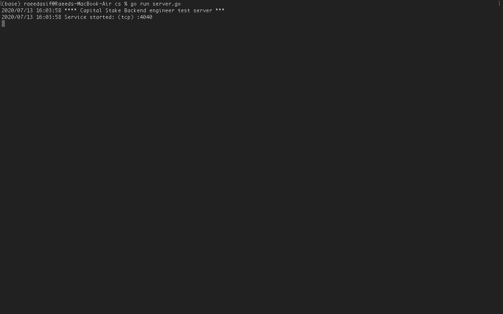
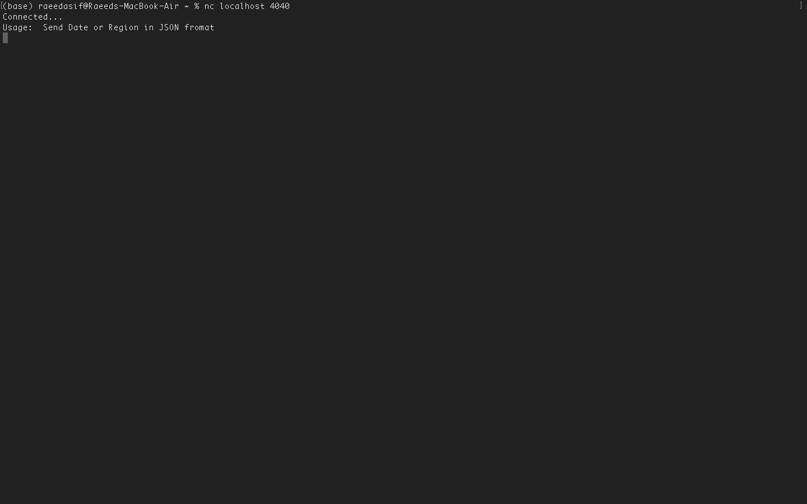
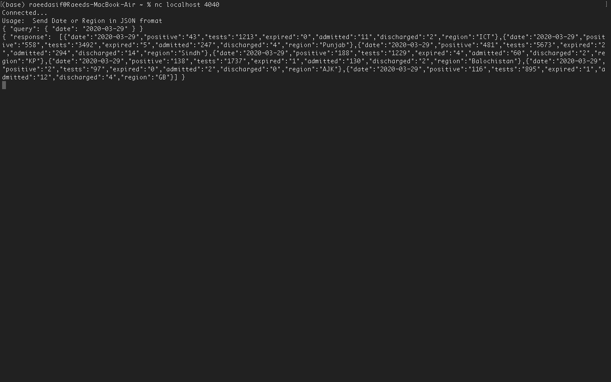
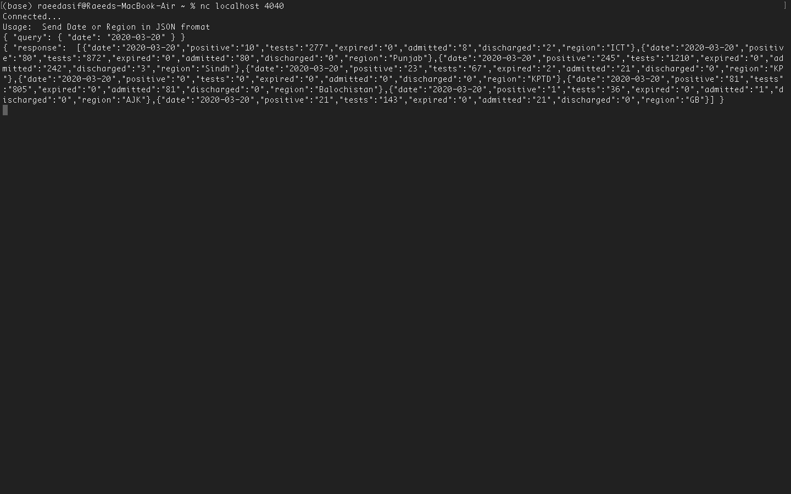
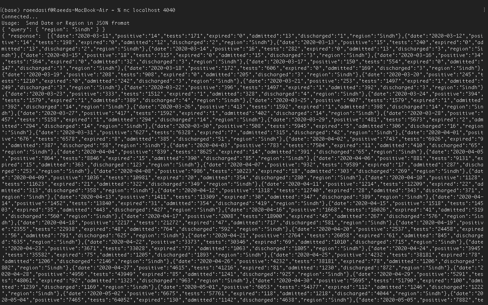

# Capital-Stake-Backend-Engineer-Test-Golang-
A repo for the test code as required by a software house in golang

## How to run
1) Install golang , https://golang.org/
2) Install NetCat , http://netcat.sourceforge.net/
3) Run server.go
4) in another command line , use "nc localhost 4040"
5) send quries in this tab and receive response

## Screenshots

1. Server

2. Client

2. Response
Date: 2020-03-29

Date: 2020-03-20

Region: Sindh

